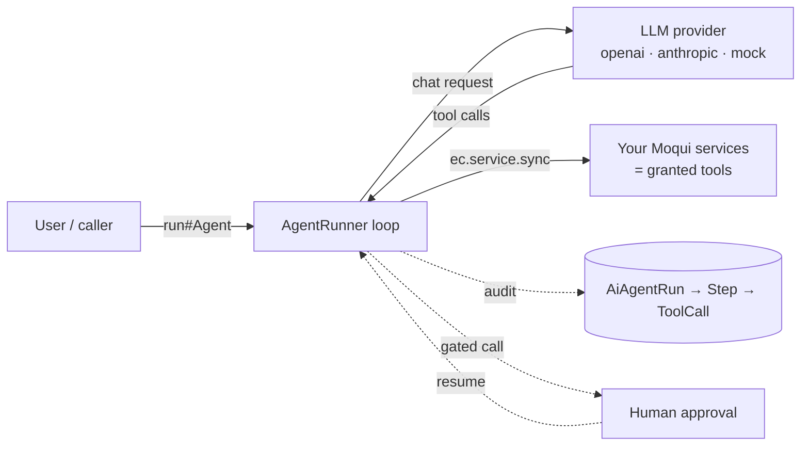
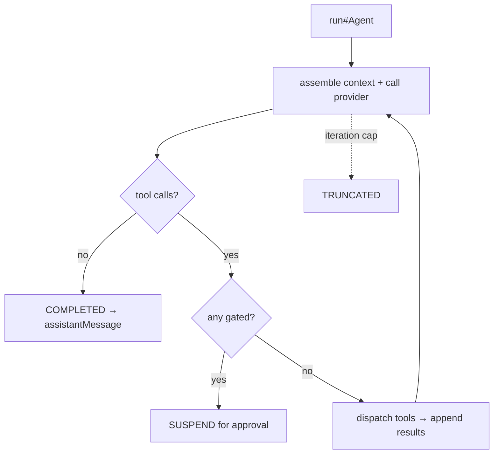
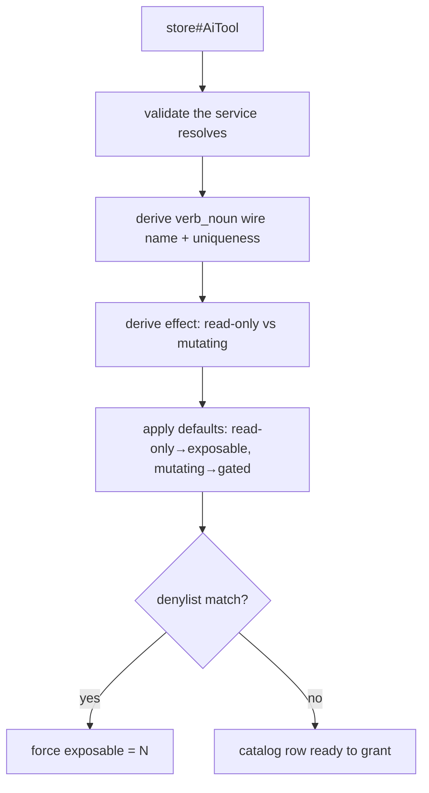
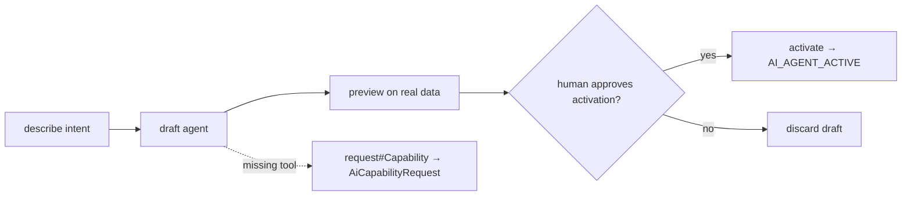
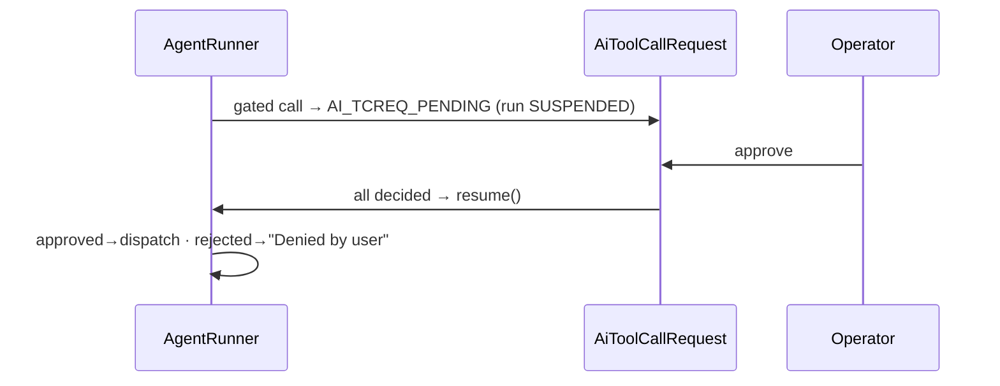
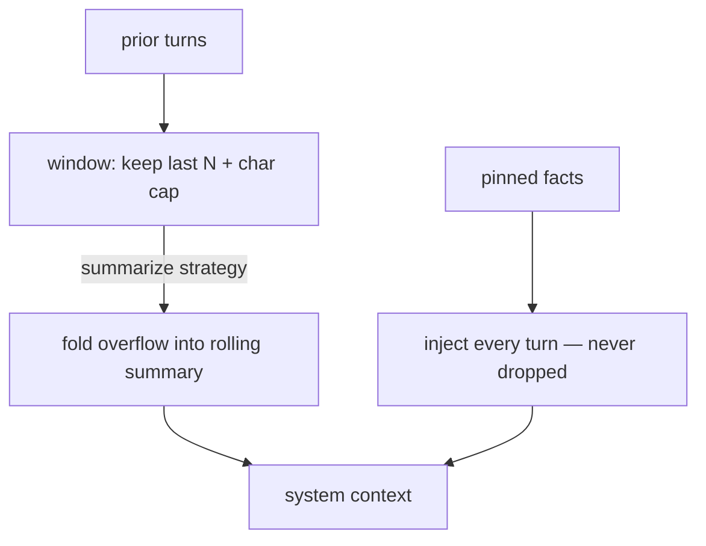
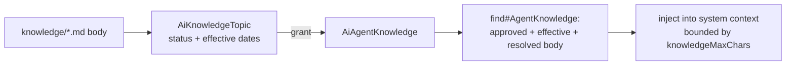
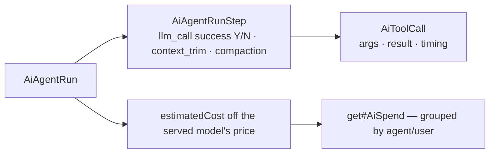

# moqui-ai — Capabilities Guide

> **What this is, and what you can do with it.** This guide orients anyone new to the
> component — operators and developers alike — to *every capability moqui-ai ships*, with a
> concrete scenario and a small workflow for each.
>
> It is deliberately **capability-first**, not field-first. For exact entity fields, service
> parameters, and screen transitions, follow the links into
> [`reference/`](reference/); for the deeper *why*, see [`explanation/architecture.md`](explanation/architecture.md).
> Where this guide and the code disagree, **the code wins**.

---

## 1. Orientation

**moqui-ai is a Moqui-native AI agent framework.** An *agent* is a row in the database
(`AiAgent`); a *tool* is an ordinary Moqui service the agent is allowed to call (`AiTool`);
*running* an agent is a normal service call (`ai.AgentServices.run#Agent`). There is **no
`ec.ai` facade, no Spring, no annotations** — the whole framework is reachable through
`service.xml`, `ec.service`, and `ec.entity`, plus one registered `ToolFactory`.

The mental model in one sentence:

> An agent is an LLM loop that calls your existing Moqui services as tools — and the framework
> handles the provider wire formats, the loop, persistence, observability, cost, human-approval
> gating, and an operational console.



Two ideas hold the rest together:

- **The registry is the keystone.** Agents and tools have opaque ids (`agentId`, `toolId`); the
  database is the source of truth; a service does not become callable by an agent just by
  existing — it must be *authored* into the catalog and pass a safety floor.
- **An agent runs as the signed-in user.** Every tool call goes through the normal Moqui service
  layer, so an agent can never read or do anything the operator who launched it couldn't.

Everything below is a capability built on those two ideas.

---

## 2. Capabilities

Each capability follows the same shape: **Role · Scenario · Workflow · How it helps · Where it
lives** (operator screen / developer entry point).

### 2.1 Run an agent (the agentic loop)

**Role.** The core: drive an LLM to a goal, letting it call tools, until it answers or hits a
ceiling.

**Scenario.** An operator types *"What's the status of order 12345?"* into the Playground for the
order-helper agent. The agent calls `get_order`, reads the result, and replies in plain language —
all in one `run#Agent` call.

**Workflow.**


**How it helps.**
- One call does the whole loop — context assembly, provider call, tool dispatch, repeat.
- Bounded by `maxIterations` / `maxTokens` / `maxToolCallsPerTurn`, each mapping to a terminal
  status (`AI_RUN_COMPLETED` / `TRUNCATED` / `ABORTED` / `FAILED` / `SUSPENDED`).
- Holds **no enclosing transaction** — LLM calls run outside any tx; each tool call and audit
  write manages its own.

**Where it lives.** Operator: **Playground**. Developer: `ai.AgentServices.run#Agent` (takes the
opaque `agentId`) → `org.moqui.ai.AgentRunner`. See [reference/services.md](reference/services.md#run-agent).

### 2.2 Tools = gated services (the registry & safety floor)

**Role.** Turn an existing Moqui service into an LLM-callable tool — safely.

**Scenario.** A developer wants the agent to be able to list orders. They author an `AiTool` over
`notnaked.OmsAiServices.get#OrderSummaryList`; the framework derives the wire name `get_order_summary_list`,
classifies it read-only, and marks it exposable. A request to expose `delete#Something` is instead
forced non-exposable by the denylist.

**Workflow.**


**How it helps.**
- A service isn't blindly exposed: `store#AiTool` is the single authoring gate that classifies
  effect, applies an **`AiToolDenylist`** non-overridable floor, and gates exposure via `exposable`.
- Opaque `toolId` + `verb_noun` wire name → a tool can be renamed or re-pointed without breaking
  grants or history.
- An agent only ever sees its **explicitly granted** tools (`AiAgentTool`), not the whole catalog.

**Where it lives.** Operator: **Agents** (tool grants). Developer: `ai.ToolServices.store#AiTool`,
`ai.AgentServices.store#AiAgentTool`; entities `AiTool` / `AiToolDenylist` / `AiAgentTool` in
[reference/entities.md](reference/entities.md).

### 2.3 Composer — build agents conversationally

**Role.** Build a working agent from a plain-English description, with the framework pointed at
itself.

**Scenario.** *"Make me an agent that summarizes recent orders."* The Composer searches the catalog,
proposes a name (grounded in the glossary), grants the matching read tools, previews the draft on
real data, and — after a human approves — activates it. If a needed tool doesn't exist, it records a
**capability request** instead of inventing one.

**Workflow.**


**How it helps.**
- Self-service agent authoring — the Composer is just the ordinary loop whose granted tools are the
  framework's own authoring meta-services.
- Safe by construction: it can never fabricate a tool (only a Curator creates tools), and
  **activation itself requires human approval**.
- Gaps become tracked signals (`AiCapabilityRequest`) rather than dead-ends.

**Where it lives.** Operator: **Composer**. Developer: `ai.ComposerServices.*`
(`find#Capability`, `propose#Naming`, `preview#Agent`, `activate#Agent`, `request#Capability`, …).
Narrative: [product/composer-assistant-overview.md](product/composer-assistant-overview.md).

### 2.4 Human-approval gate & preview

**Role.** Make a mutating action pause for a human before it runs.

**Scenario.** An agent proposes `refund_order(...)`. Because that tool is `requiresApproval`, the
whole turn **suspends**; an operator opens Approvals, sees the exact arguments, and approves — only
then does the refund run and the agent continue. In *preview* mode, **every** mutating call is held
this way, so a draft can be exercised on real data with nothing irreversible executed.

**Workflow.**


**How it helps.**
- **Fail-closed:** a gated tool can never run without an explicit decision; a premature or
  double-fired resume is a safe no-op.
- The suspended turn is withheld from the conversation, so history never holds an orphan tool call.
- **Preview** force-gates all mutating tools and is throwaway — its pending rows stay out of the real
  operator queue and are deleted on discard.

**Where it lives.** Operator: **Approvals**. Developer: `ai.ToolCallRequestServices.*`
(`approve#ToolCallRequest` / `reject#ToolCallRequest` / `decide#ToolCallRequest` / `get#PendingToolCallRequest`); entity
`AiToolCallRequest`.

### 2.5 Conversations & memory (context management)

**Role.** Keep multi-turn continuity without losing confirmed facts or blowing the context window.

**Scenario.** Over a long conversation the customer confirms an order total of $4,812.50. Dozens of
turns later, after older messages have scrolled out of the window, the agent still quotes the exact
total — because it `remember`ed it as a pinned fact.

**Workflow.**


**How it helps.**
- Three strategies per agent: `off`, `window` (bound replayed history), `summarize` (window +
  rolling compaction of overflow).
- **Pinned facts** (`AiConversationFact`) live *outside* the compressible transcript and are
  re-injected every turn — the fidelity guarantee that makes the lossy layers safe.
- A built-in server-side `remember` tool lets the model pin a value the moment it's confirmed; the
  `conversationId` is injected server-side, never model-supplied.

**Where it lives.** Operator: **Conversations**. Developer: `contextStrategy` on `AiAgent`;
entities `AiConversation` / `AiConversationMessage` / `AiConversationFact`; ADR
[decisions/0001-context-window-management.md](decisions/0001-context-window-management.md).

### 2.6 Agent knowledge base

**Role.** Give an agent curated background prose that's injected into its system context on every
run.

**Scenario.** The Composer agent should reason in OMS vocabulary, so it's granted the *OMS Domain
Primer* topic. Every Composer run silently includes that primer, so it knows what "allocation" or
"brokering" means without being told each time.

**Workflow.**


**How it helps.**
- Bodies are git-versioned `.md` files; the entity is just the queryable spine (status, effective
  dates, the content pointer) — no DB blobs.
- Injection is **unconditional** (any `contextStrategy`, even `off`) and bounded by a char cap that
  drops whole topics (never a partial body), recording what it dropped.
- A missing body file is logged and skipped — it never fails a run.

**Where it lives.** Operator: **Knowledge**. Developer: `ai.KnowledgeServices.*`
(`store#KnowledgeTopic`, `approve#`, `store#AgentKnowledge`, `find#AgentKnowledge`); entities
`AiKnowledgeTopic` / `AiAgentKnowledge`.

### 2.7 Builder Knowledgebase / glossary (naming)

**Role.** Make generated agent/tool names speak the deployment's real vocabulary.

**Scenario.** An author types "rma agent"; the glossary snaps "rma" to its canonical term "return",
so the proposed name and tooling speak the operator's dialect rather than a raw guess.

**How it helps.**
- A curated, OMS-grounded glossary (`AiDomainTerm`) with dialect synonyms (`AiTermSynonym`) grounds
  the Composer's naming.
- A learning log (`AiNamingSignal`) records proposed-vs-kept names; recurring tokens can be
  *promoted* to suggested terms for a Curator to approve — nothing auto-enters the vocabulary (v1 is
  lexical + suggest-only).

**Where it lives.** Operator: **Glossary**. Developer: `ai.GlossaryServices.*`
(`seed#DomainGlossary`, `find#DomainTerm`, `promote#TermsFromSignals`, `approve#DomainTerm`).

### 2.8 Multi-provider failover

**Role.** Survive a provider/model outage mid-run without losing the conversation.

**Scenario.** The primary model errors on the first call; the loop falls through to the next
candidate, which answers — and then **stays** on that working candidate for the rest of the run
rather than re-probing the broken primary each turn.

**How it helps.**
- An ordered candidate chain (`AiAgentModel`, by `priority`); a single-model agent just works with
  no chain.
- **Sticky** failover, with each skipped candidate recorded as a failed `llm_call` step (`success=N`).
- Cost and history are stamped against the model that *actually* served the run.

**Where it lives.** Developer: `AiAgentModel` rows; see
[explanation/architecture.md](explanation/architecture.md#multi-provider-failover).

### 2.9 Reasoning effort

**Role.** Dial how hard a reasoning-capable model "thinks."

**Scenario.** A planning agent is set to `reasoningEffort = high`; on OpenAI this maps to
`reasoning_effort`, on Anthropic to an extended-thinking budget.

**How it helps.** One provider-agnostic knob (`low`/`medium`/`high`) translated to each provider's
native mechanism; no effect on models that don't support it. (v1: Anthropic thinking is applied only
to agents without tool grants.)

**Where it lives.** Developer: `reasoningEffort` on `AiAgent`.

### 2.10 Structured output

**Role.** Get a typed, schema-conforming object back instead of free text.

**Scenario.** A classification agent declares a `responseSchema`; `run#Agent` returns
`structuredResult` as a parsed `Map` (`{ "label": "refund_request" }`) the caller can use directly.

**How it helps.** `responseSchema` (JSON Schema) is translated to each provider's native mechanism —
OpenAI `response_format: json_schema`, Anthropic a synthetic `structured_output` tool — and surfaced
as a typed `structuredResult`.

**Where it lives.** Developer: `responseSchema` on `AiAgent`; `structuredResult` out-param of
`run#Agent`.

### 2.11 Cost awareness & observability

**Role.** Know what every run cost and exactly what happened inside it.

**Scenario.** After a week of demos, an admin opens Cost, groups spend by agent, and sees which
agent is expensive; drilling into a Run shows every LLM call, tool call, failover, and context trim
in order.

**Workflow.**


**How it helps.**
- Every run, step, tool call, and approval is persisted — a recoverable, auditable story.
- `estimatedCost` is priced off the model that *actually* served the run (correct after failover);
  `get#AiSpend` aggregates it.
- **Security:** an agent runs as the signed-in user, so its data access is exactly that user's — it
  can never become a back-door to data the operator can't see.

**Where it lives.** Operator: **Runs / RunDetail / Cost**. Developer: entities `AiAgentRun` /
`AiAgentRunStep` / `AiToolCall`, `AiModelPrice`; `ai.CostServices.*`. Security:
[explanation/security-model.md](explanation/security-model.md).

---

## 3. Getting started

### ▸ For operators

1. Open the console at **`/apps/AiOps`** (any authenticated user — see Boundaries).
2. **Playground** — pick an agent, send a message, watch the run and its trace.
3. **Composer** — describe an agent in plain English; preview it on real data; approve to activate.
4. **Approvals** — decide the mutating actions agents propose.
5. **Runs / Cost / Conversations / Knowledge / Glossary** — observe, price, and curate.

### ▸ For developers

**Run an agent** (the opaque `agentId` is the invocation key; resolve a name to an id first, e.g.
via `create#Conversation`, which accepts an `agentName`):
```groovy
def r = ec.service.sync().name("ai.AgentServices.run#Agent").parameters([
    agentId:        "100123",
    userMessage:    "Cancel order 12345 and tell me the refund total.",
    conversationId: null            // pass an id to replay + persist multi-turn history
]).call()
r.assistantMessage     // final text
r.structuredResult     // parsed Map when the agent has a responseSchema
r.statusId             // AI_RUN_COMPLETED | TRUNCATED | ABORTED | FAILED | SUSPENDED
```

**Author a tool** — wrap an existing service: `ai.ToolServices.store#AiTool` (it validates the
service, derives the effect, applies the denylist), then grant it with `store#AiAgentTool`.

**Add a provider** — implement `org.moqui.ai.LlmProvider` (one method, `Map chat(Map request)`);
the factory registers it when its API key is configured.

Configuration (keys, defaults): [reference/configuration.md](reference/configuration.md).

---

## 4. Boundaries — what's deferred, and where to go deeper

**Known v1 boundaries** (deliberate; see [explanation/decisions.md](explanation/decisions.md)):
- **`maxCost` is stored but not enforced** — cost is recorded, not a runtime ceiling.
- **Console access is authentication-only** — any logged-in user can open AiOps and read the
  approval queue; a scoped `AI_OPERATOR` group is deferred.
- **Capability requests have no Curator console yet** — `AiCapabilityRequest` is captured but the
  review/resolve UI is a follow-up.
- **No retrieval/RAG, no Google/Gemini provider, no streaming** in v1.

**Where to go deeper:**
- [reference/](reference/) — as-built field catalogs: `entities.md`, `services.md`, `screens.md`,
  `configuration.md`
- [explanation/architecture.md](explanation/architecture.md) — how and *why* the loop, providers,
  context, approval, registry, and Composer work
- [explanation/security-model.md](explanation/security-model.md) — console access, membership, and
  agent-runs-as-user
- [decisions/0001-context-window-management.md](decisions/0001-context-window-management.md) — the
  context-management ADR
